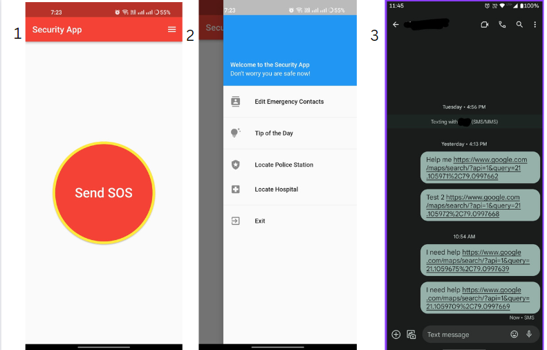
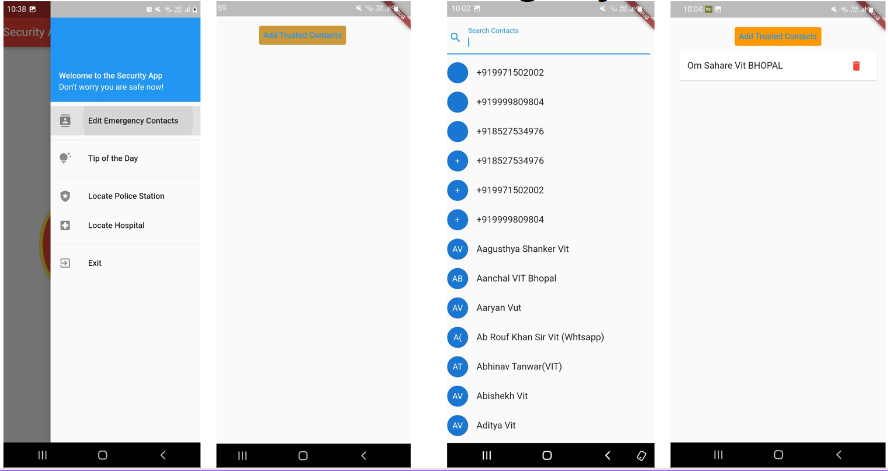
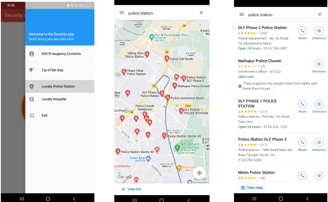
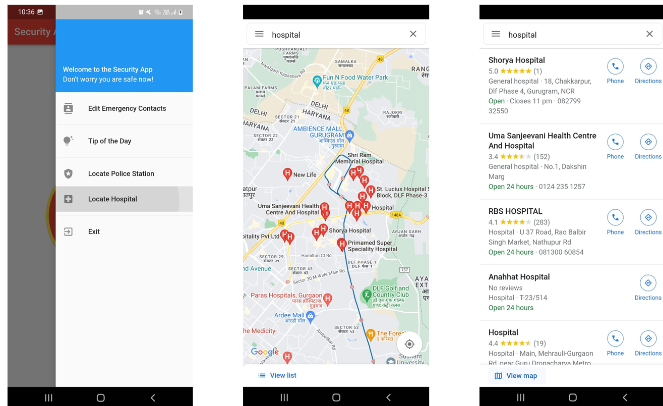
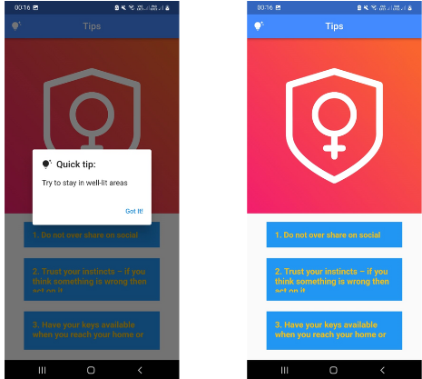

# SafeSentinel

Introducing SafeSentinel, the ultimate Women's Security App that prioritizes your safety and peace of mind. Designed to be your steadfast companion, SafeSentinel offers a comprehensive suite of features to ensure your protection and well-being in any situation.

With SafeSentinel, sending an SOS message is as easy as a single tap. In times of emergency, simply activate the SOS feature, and the app will automatically send an SMS to your trusted contacts, providing them with your precise location. Whether you're walking alone at night or find yourself in an uncomfortable situation, SafeSentinel empowers you to reach out for help with ease and speed.

But SafeSentinel doesn't stop there. It goes the extra mile to provide you with crucial information at your fingertips. The app incorporates a sophisticated mapping system that displays nearby hospitals and police stations, allowing you to quickly locate safe havens or seek assistance when needed. Your safety should never be compromised, and SafeSentinel ensures that help is never far away.

Knowledge is power, and SafeSentinel equips you with vital safety tips and guidance. Stay informed about personal security measures, learn self-defense techniques, and access resources to enhance your overall safety awareness. Empowering you with the tools to protect yourself, SafeSentinel is your virtual security mentor, always looking out for your well-being.

Download SafeSentinel today and experience the peace of mind you deserve. Embrace the freedom to move confidently through life, knowing that SafeSentinel is by your side, ready to assist, inform, and protect. Stay safe, and stay secure with SafeSentinel – your trusted guardian.

## Table of Contents

- [Installation](#installation)
- [Usage](#usage)
- [Features](#features)
- [Contact Me](#contact-me)

## Installation

To get a local copy of this project, you can clone it using Git. Follow the steps below:

1. Open Command Prompt.
2. Change the current working directory to the location where you want the cloned directory to be saved.
3. Run the following command to clone the repository:

   ```shell
   git clone https://github.com/omsahare-14/SafeSentinel/
   ```
4. After executing the command, the repository will be cloned to your local machine. Now you have a local copy of the project to work with.


## Usage
Our app is designed to run smoothly on any Android device running Android 8 or later. The primary feature of the app is the SOS button, which, when triggered, sends a distress message to the victim's trusted contacts. This is done through the use of SMS messages, which are sent to the designated contacts immediately after the SOS button is pressed. The SMS message contains a custom message that the user can personalize to their liking, which will include a request for help as well as a link to the current location of the victim. This feature can be especially useful in emergencies where the user may not be able to provide detailed information on their location, or may be unable to speak.







## Features

- Nearest Police Station: We understand the importance of personal safety, and our app is designed to provide users with the tools they need to stay safe in any situation. SafeSentinel allows users to locate their nearest police stations with one tap.



- Nearest Hospital: In case of an emergency, the user might also need to rush to the hospital, hence the feature to locate the nearest hospital is also embedded inside the app.



- Tips for Personal Safety: In addition to the SOS button, the app also includes features designed to promote personal safety and awareness. These include tips for staying safe in various situations, such as traveling alone or walking in unfamiliar areas, as well as directions to the nearest safe location.




## Contact Me

If you have any questions, feedback, or suggestions, feel free to reach out to me.

- Email: [omsahareofficial@gmail.com](mailto:omsahareofficial@gmail.com)
- LinkedIn: [om-sahare-253b30207/](https://www.linkedin.com/in/om-sahare-253b30207/)
- Twitter: [@omsahare14](https://twitter.com/omsahare14)
